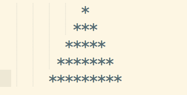
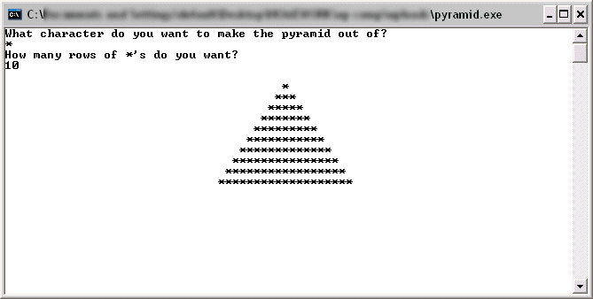
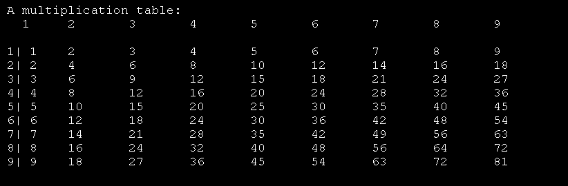

# Temperature Converter

Create a simple temperature converter. It should function like the example below:

Type '1' to convert from Celsius to Fahrenheit or type '2' to convert from Fahrenheit to Celsius.

Example:
1
Enter Celsius Temperature:
24
24 degrees Celsius is equal to 75.2 degree Fahrenheit

# Odd Numbers

Write code to print all the odd numbers between 1 and 1337

# Guessing Game

Create a program that picks a random number between 1 and 100 and then asks the user to guess the number. Once the user guesses a number, the program should say, higher, lower, or tell the user that they got the number correct. The user should continue to make guesses until he guesses correctly. Also, once the user guesses correctly, the program should print the number of guesses needed to arrive at the correct answer. Below is sample output:

Guess a number between 1 and 100
50
The number is lower than 50.  Guess again
25
The number is lower than 25.  Guess again
13
The number is higher than 13.  Guess again
20
The number is lower than 20.  Guess again
17
The number is higher than 17.  Guess again
18
The number is higher than 18.  Guess again
19
You got it in 7 tries

# Simple Ascii Art

Part 1
Using loops (don't just use a bunch of puts statements!), print out a simple ascii art triangle like the one below:

Part 2
Ask the user for the number of rows and the ascii character that the pyramid should consist of Here's an example:

# Reverse A String

Reverse a string in place. In other words, do not create a new string or use other methods on the string such as reverse. The goal of the problem is to use a loop and the string accessors to figure out which values to swap for other values. Below is the output.

Enter a string:
  reverse_me
em_esrever

# Prime Numbers

Write a method called prime_printer(max) which takes one integer argument. It should print out all the prime numbers between 0 and the given argument.

# Fibonacci

Write code to print out the first 100 Fibonacci numbers. Read more about the Fibonacci sequence here

# Palindrome Checker

Write code that determines if a given string is a palindrome. Do not use the .reverse() String method. You can use the code you wrote for the above problem.

Here's some sample output:

Enter a string:
racecar
racecar is a palindrome

Enter a string:
internet
internet is NOT a palindrome

# Screwing with the Array Class

Write the following methods ON the built in Array class:

Say_hello
nums = [1,2,3]
nums.say_hello
#=> "HEY THERE, I'M AN ARRAY! SOMEONE FUCKED WITH MY CODE :("

count_evens
nums = [2,5,9,15,22,99]
nums.count_evens
#=> "HI FRIEND, I AM ARRAY.  I HAVE 2 EVEN NUMBERS.  PRETTY AWESOME YES?  I LOVE YOU GOODBYE"

It must output the above message word for word.

# Multiplication Table

Create a 9 x 9 multiplication table like the one below. Make sure to pay attention to spacing! Make it look nice!

For an extra challenge, allow the user to specify the size of the multiplication table (3 x 10, 5 x 5, etc.)

# Object Oriented Rock/Paper/Scissors

Write a terminal based rock, paper, scissors game. You must use at least one class in your implementation.

# Conway's Game of Life

Implement Conway's Game of Life as a terminal based ruby program. Implement at least 2 classes. Read more about it http://en.wikipedia.org/wiki/Conway%27s_Game_of_Life

The universe of the Game of Life is an infinite two-dimensional orthogonal grid of square cells, each of which is in one of two possible states, alive or dead. Every cell interacts with its eight neighbours, which are the cells that are horizontally, vertically, or diagonally adjacent. At each step in time, the following transitions occur:

Any live cell with fewer than two live neighbours dies, as if caused by under-population.
Any live cell with two or three live neighbours lives on to the next generation.
Any live cell with more than three live neighbours dies, as if by overcrowding.
Any dead cell with exactly three live neighbours becomes a live cell, as if by reproduction.
The initial pattern constitutes the seed of the system. The first generation is created by applying the above rules simultaneously to every cell in the seed—births and deaths occur simultaneously, and the discrete moment at which this happens is sometimes called a tick (in other words, each generation is a pure function of the preceding one). The rules continue to be applied repeatedly to create further generations.
